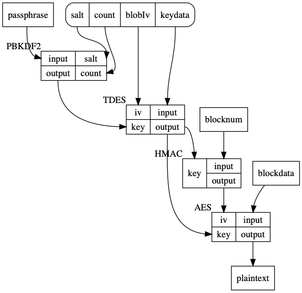

readencrcdsa
============

A tool for decrypting Apple encrypted disk images.
Both old 'v1' and current 'v2' images are supported.
This tool can also decrypt iphone rootfilesystem diskimages.

Several types of diskimages exist:

 * with the `cdsaencr` v1 header at the end of the file.
   * one passphrase wrapped key
 * with the 'encrcdsa' v2 header at the start of the file.
   Can have multiple wrapped keys:
    * passphrase wrapped key(s)
    * certificate wrapped key(s)
    * third unknown option, 'keybag'

 * iphone firmware images are a special case of the v2 passphrase
   wrapped keys, where the kdf part is skipped, even though
   the header does specify use 'pbkdf2'.

normal images
=============

There are several ways of creating encrypted diskimages
 * `Disk Utility.app`  using CMD-N
 * from the commandline, using hdiutil
    
    hdiutil create -srcfolder testfiles -size 16m -fs HFS+ -encryption AES-128 encryptedimage.dmg

In a script, you can use -stdinpass to avoid `hdiutil` to prompt for a password. The entire
input, including LineFeeds will be used for the password. So this:

    echo test1234 | hdiutil create -stdinpass -size 16m -encryption AES-128 encryptedimage.dmg

Will create an encrypted image where the password is: `test1234 + LF`.

mounting
--------

Disk images can be mounted by opening them in Finder, or using the commandline:

    hdiutil attach encryptedimage.dmg

Which will prompt the user for a password, alternatively, the password can be passed using a script:

    echo -n test1234 | hdiutil attach -stdinpass encryptedimage.dmg

Pass the `-nomount` option When you want to attach without mounting, you can then access the contents
of the disk image via its `/dev/diskNN` or `/dev/rdiskNN` device.

Pass the `-readonly` when you want to mount the image in read-only mode.

decrypting
----------

You can decrypt such images using my tool:

    python3 readencrcdsa.py --save -p test1234 encryptedimage.dmg

This will save the decrypted image as `encryptedimage-decrypted.dmg`

certificates
------------

A special option exists in `hdiutil` to create diskimages which can be decrypted using a RSA privatekey.

    hdiutil create  -srcfolder testfiles -certificate ax509cert.cer -size 16m -fs HFS+ -encryption AES-128  encryptedimage.dmg

Decrypt such an image using the following commandline:

    python3 readencrcdsa.py --save --privatekey private.key encryptedimage.dmg

iphone firmware images
=============

Iphone images are downloaded as `.ipsw` files.

    http://appldnld.apple.com.edgesuite.net/content.info.apple.com/iPhone/061-6582.20090617.LlI87/iPhone2,1_3.0_7A341_Restore.ipsw

The `ipsw` file is a PKZIP file, this file contains several diskimages:
 * 018-5302-002.dmg, the root filesystem
 * 018-5304-002.dmg, 018-5306-002.dmg, the encrypted update and restore ramdisk images.

Decrypting iphone ramdisk images is done using a different tool, named `img3tool`.

The rootfilesystem is encrypted with a hash of either of the decrypted ramdisk images. To use this hash to decrypt the 
root filesystem, you have to pass the `-n` option disabiing the normal password hashing code.

    python3 readencrcdsa.py -n -P a597f200228fb4766e4c8a2a03bcb54d83c75f538fb75a981229f0c09d7ac85f ipsw/018-5302-002.dmg

Alternatively, when you know the master key, you can specify this directly using `-K`

    python3 readencrcdsa.py -K 7d779fed28961506ca9443de210224f211790192b2a2308b8bc0e7d4a2ca61a68e26200e ipsw/018-5302-002.dmg

OSXSDK
======

The relevant headers from the MacOSX sdk:

    [Security.framework/Versions/A/Headers/cssmtype.h](https://github.com/phracker/MacOSX-SDKs/blob/master/MacOSX10.13.sdk/System/Library/Frameworks/Security.framework/Versions/A/Headers/cssmtype.h)
    [Security.framework/Versions/A/Headers/cssmapple.h](https://github.com/phracker/MacOSX-SDKs/blob/master/MacOSX10.13.sdk/System/Library/Frameworks/Security.framework/Versions/A/Headers/cssmapple.h)

The Algorithm
=============

v2
input: passphrase, blocknum, encrypteddata

        hashedpw = pbkdf2(passphrase, keydata.kdfSalt[:keydata.kdfSaltLen], keydata.kdfIterationCount)

        deskey = hashedpw[:keydata.blobEncKeyBits//8]

        iv = keydata.blobEncIv[:keydata.blobEncIvLen]

        des = DES3.new(deskey, mode=DES3.MODE_CBC, IV=iv)
        unwrappeddata = des.decrypt(keydata.encryptedKeyblob[:keydata.encryptedKeyblobLen])
        keydata = remove_pkcs7_padding(unwrappeddata, keydata.blobEncIvLen)

        aeskey = keydata[:dmghdr.keyBits//8]
        hmackey = keydata[dmghdr.keyBits//8:]

        iv = hmacsha1(hmackey, struct.pack(">L", blocknum))
        aes = AES.new(aeskey, mode=AES.MODE_CBC, IV=iv[:dmghdr.blockIvLen])
        decrypteddata = aes.decrypt(encrypteddata)

or as a simplied diagram:

Possible weaknesses
===================

Note that getting the wrong hmackey, will result in only the first 16 bytes of each disk block being incorrect.
This makes it possible to swap diskblocks around with only minimal 'damage' to the block.
In practice maybe not of much use, since the contents of the dmg is usually compressed.

I noticed that in practice the HMAC key and the AES key are usually the same in the unwrapped keydata.
They could have been different, but apparently Apple's disk image tools create the keyblob with identical keys.
Not a major issue, but it does mean less entropy is used in the algorithm.

AUTHOR
======

(C) 2019 Willem Hengeveld <itsme@xs4all.nl>

